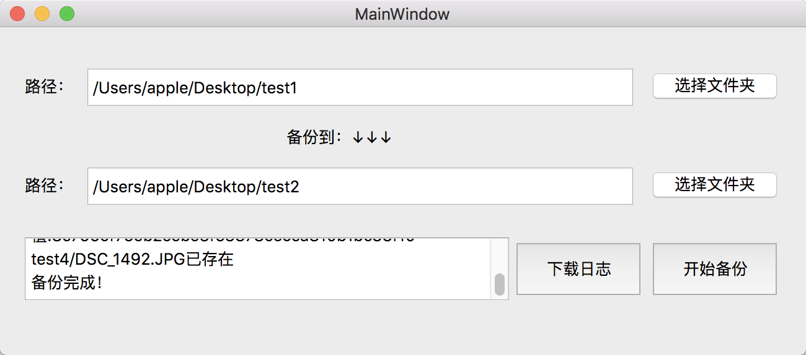

# FileBackup
### 1、introduction 

FileBackup based on Qt

### 2、function

When the file is both different of the old one in `filename` and `file content`, it will be ignored.

When it just has the same `filename` with different content, it will be backed up with a new name.

### 3、screenshot

